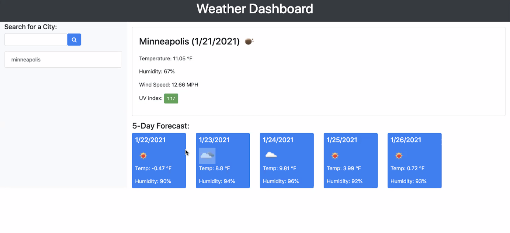
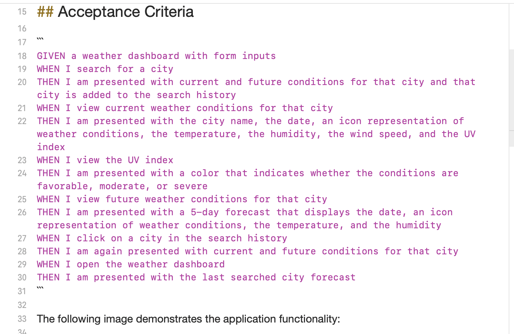
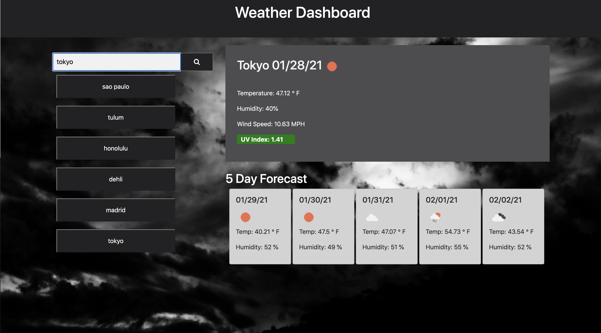

# Assignment 6:
## Title: Weather App
Create a weather app like the following:

# Requirements
The accepatance criteria were as follows: 

# Technologies Used:
### HTML
### CSS
### Bootstrap
### JavaScript
### jQuery
### moment.js
### Local Storage
### JSON
### AJAX

# Usage: 
This app helps show the user the weather for a specified city chosen by the user.   When entered, the app returns the current weather data as well as a five day forecast.   Then a button is created of the searched city that can later be clicked on to retrieve the weather information again.  The app shows the dates, the weather icon describing the weather, a wind speed in MPH, a UV Index (that is color coded based on the number), the humidity,  and the temperature. 

# Visuals:
### Laptop:

  

### Mobile:

# App Website:
https://ckhilpisch.github.io/Weather_06/

# Contact Info:
Carolyn Hilpisch - ckhilpisch@gmail.com

# License:

MIT
